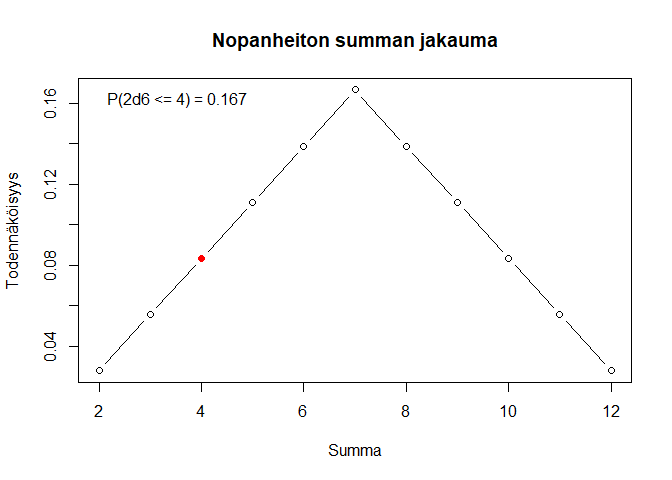
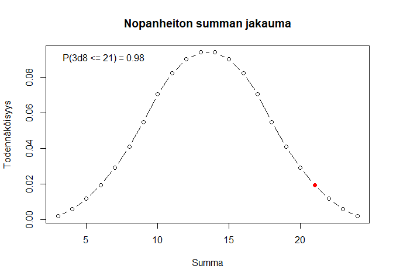

# Noppa

Heitä k kertaa n-sivuista noppaa, esitä tulokset, laske niiden summa ja
sen todennäköisyys. Lisäksi funktio voi piirtää summan
pistetodennäköisyysfunktion.

``` r
# remotes::install_github("rajalah71/noppa")
library(noppa)
```

``` r
noppa(lkm, sivuja, plot, takaisinpalautus)
```

``` r
noppa(lkm = 1, sivuja = 6)
```

    ## Heitit: 1 
    ## P(1d6 <= 1) = 0.167

``` r
noppa(2,6)
```

    ## Heitit: 2, 1 
    ## Summa: 3 
    ## P(2d6 <= 3) = 0.083

``` r
noppa(2,6, plot = TRUE)
```

    ## Heitit: 2, 2 
    ## Summa: 4 
    ## P(2d6 <= 4) = 0.167

<!-- -->

``` r
noppa(3,8, plot = TRUE)
```

    ## Heitit: 6, 8, 7 
    ## Summa: 21 
    ## P(3d8 <= 21) = 0.98

<!-- -->
