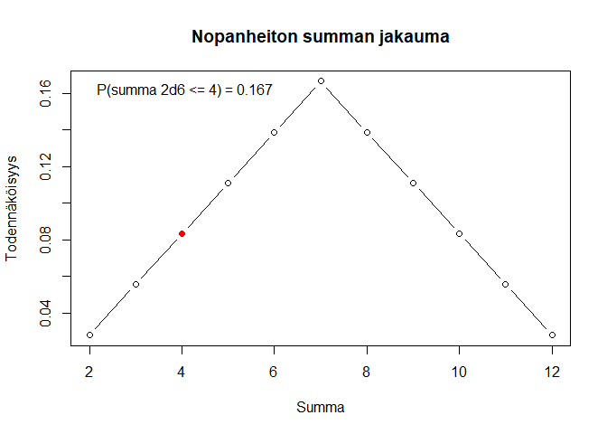
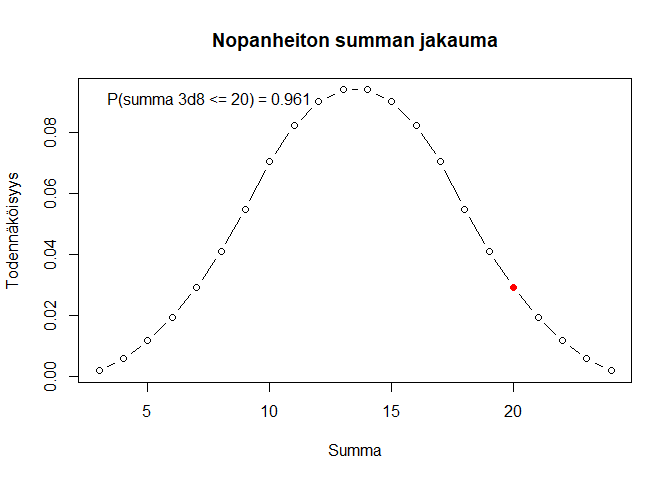

# Noppa

Heitä n-sivuista noppaa k kertaa, esitä tulokset, laske niiden summa ja
sen todennäköisyys. Lisäksi funktio voi piirtää summan
pistetodennäköisyysfunktion.

``` r
library(noppa)

noppa(6)
```

    ## Heitit: 4

``` r
noppa(6, 2)
```

    ## Heitit: 3 6
    ## Summa: 9 
    ## P(summa 2d6 <= 9) = 0.833

``` r
noppa(6, 2, plot = TRUE)
```

    ## Heitit: 3 1
    ## Summa: 4 
    ## P(summa 2d6 <= 4) = 0.167

<!-- -->

``` r
noppa(8, 3, plot = TRUE)
```

    ## Heitit: 8 8 4
    ## Summa: 20 
    ## P(summa 3d8 <= 20) = 0.961

<!-- -->
