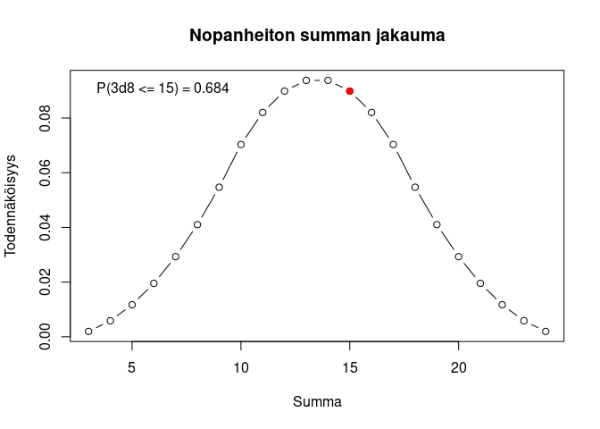

# Noppa

Heitä k kertaa n-sivuista noppaa, esitä tulokset, laske niiden summa ja
sen todennäköisyys. Lisäksi funktio voi piirtää summan
pistetodennäköisyysfunktion.

``` r
library(noppa)
```

``` r
noppa(lkm, sivuja, plot, takaisinpalautus)
```

``` r
noppa(lkm = 1, sivuja = 6)
```

    ## Heitit: 3

``` r
noppa(2,6)
```

    ## Heitit: 4, 5
    ## Summa: 9 
    ## P(2d6 <= 9) = 0.833

``` r
noppa(2,6, plot = TRUE)
```

    ## Heitit: 1, 1
    ## Summa: 2 
    ## P(2d6 <= 2) = 0.028

<!-- -->

``` r
noppa(3,8, plot = TRUE)
```

    ## Heitit: 4, 8, 3
    ## Summa: 15 
    ## P(3d8 <= 15) = 0.684

<!-- -->
