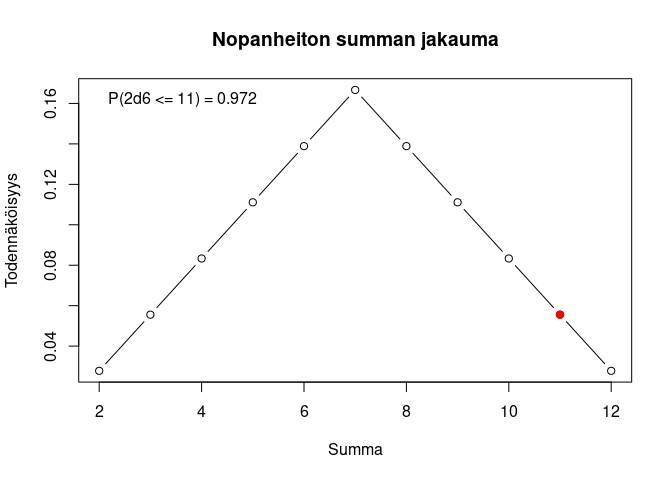
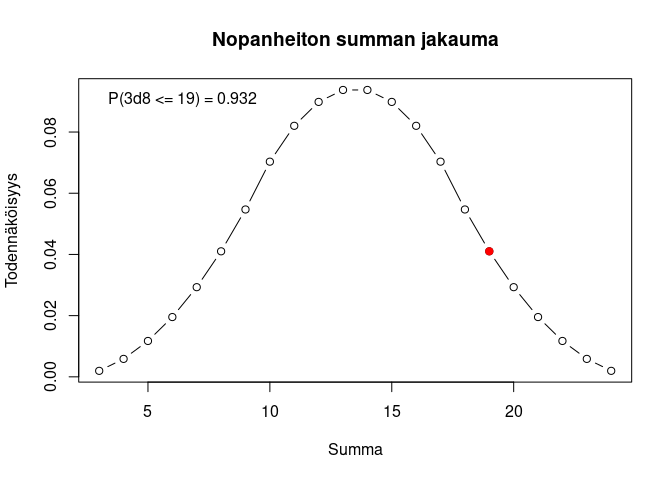

# Noppa

Heitä k kertaa n-sivuista noppaa, esitä tulokset, laske niiden summa ja
sen todennäköisyys. Lisäksi funktio voi piirtää summan
pistetodennäköisyysfunktion.

``` r
library(noppa)
```

``` r
noppa(lkm, sivuja, plot, takaisinpalautus)
```

``` r
noppa(lkm = 1, sivuja = 6)
```

    ## Heitit: 1

``` r
noppa(2,6)
```

    ## Heitit: 4, 4
    ## Summa: 8 
    ## P(2d6 <= 8) = 0.722

``` r
noppa(2,6, plot = TRUE)
```

    ## Heitit: 6, 5
    ## Summa: 11 
    ## P(2d6 <= 11) = 0.972

<!-- -->

``` r
noppa(3,8, plot = TRUE)
```

    ## Heitit: 6, 7, 6
    ## Summa: 19 
    ## P(3d8 <= 19) = 0.932

<!-- -->
